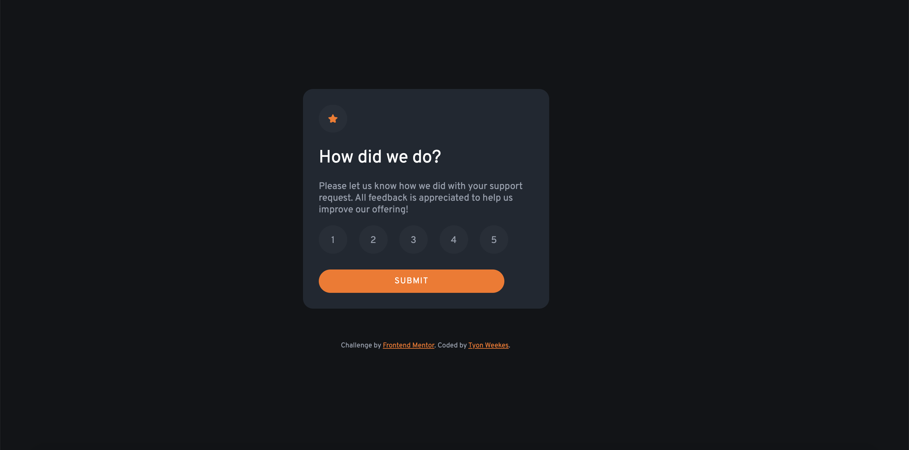

# Frontend Mentor - Interactive rating component solution

This is a solution to the [Interactive rating component challenge on Frontend Mentor](https://www.frontendmentor.io/challenges/interactive-rating-component-koxpeBUmI). Frontend Mentor challenges help you improve your coding skills by building realistic projects. 

## Table of contents

- [Overview](#overview)
  - [The challenge](#the-challenge)
  - [Screenshot](#screenshot)
  - [Links](#links)
- [My process](#my-process)
  - [Built with](#built-with)
  - [What I learned](#what-i-learned)
  - [Continued development](#continued-development)
- [Author](#author)

## Overview

### The challenge

Users should be able to:

- View the optimal layout for the app depending on their device's screen size
- See hover states for all interactive elements on the page
- Select and submit a number rating
- See the "Thank you" card state after submitting a rating

### Screenshot

### Links

- Solution URL: (https://your-solution-url.com)

## My process

### Built with

- Semantic HTML5 markup
- CSS custom properties
- Flexbox
- JavaScript

### What I learned

On the CSS side, I learned how to add circle backgrounds to icons and text. For JavaScript, I learned how to toggle the display property of an element from none to block. I also learned about textContent to change text in a span element. I knew how to change HTML before this. I also relearned that you have to put the script element at the end of the document when selecting DOM elements. They have to be above it.

### Continued development

I would like more practice with CRUD apps, as well as APIs. I also feel like there may be an easier way of handling the logic for something like the rating selection. Perhaps forEach?

## Author

- Website - [Tyon Weekes](https://www.tyonweekes.com)
